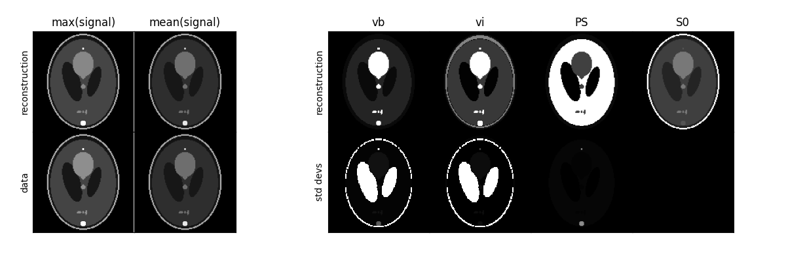

dcmri
=====

.. image:: https://github.com/dcmri/dcmri/actions/workflows/pytest-actions.yaml/badge.svg?branch=dev
  :target: https://github.com/dcmri/dcmri/actions/workflows/pytest-actions.yaml

.. image:: https://codecov.io/gh/plaresmedima/dcmri/graph/badge.svg?token=DLVVTWQ0HA 
  :target: https://codecov.io/gh/plaresmedima/dcmri

.. image:: https://img.shields.io/pypi/v/dcmri?label=pypi%20package 
  :target: https://pypi.org/project/dcmri/

.. image:: https://img.shields.io/pypi/dm/dcmri
  :target: https://pypistats.org/packages/dcmri

.. image:: https://img.shields.io/badge/License-Apache_2.0-blue.svg
  :target: https://opensource.org/licenses/Apache-2.0

A python toolbox for dynamic contrast MRI
-----------------------------------------

- **Documentation:** https://dcmri.org
- **Source code:** https://github.com/dcmri/dcmri

*Note:* dcmri is under construction. At this stage, the API may still change 
and features may be deprecated without warning.

Install
-------

Install the latest version of dcmri::

    $ pip install dcmri

ROI-based analysis
------------------

.. code-block:: python

   import dcmri as dc

   time, aif, roi, _ = dc.fake_tissue(CNR=50)   # Generate some test data
   tissue = dc.Tissue(aif=aif, t=time)          # Launch a tissue model
   tissue.train(time, roi)                      # Train the tissue on the data
   tissue.plot(time, roi)                       # Check the fit to the data

.. image:: docs/source/user_guide/tissue.png
  :width: 800

.. code-block:: python

   tissue.print(round_to=3)                     # Print the fitted parameters

.. code-block:: console

    --------------------------------
    Free parameters with their stdev
    --------------------------------

    Blood volume (vb): 0.018 (0.002) mL/cm3
    Interstitial volume (vi): 0.174 (0.004) mL/cm3
    Permeability-surface area product (PS): 0.002 (0.0) mL/sec/cm3

    ----------------------------
    Fixed and derived parameters
    ----------------------------

    Plasma volume (vp): 0.01 mL/cm3
    Interstitial mean transit time (Ti): 74.614 sec

Pixel-based analysis
--------------------

.. code-block:: python

   n = 128
   time, signal, aif, _ = dc.fake_brain(n)      # Generate some test data
   image = dc.TissueArray((n, n),               # Launch an array model
      aif = aif, 
      t = time, 
      kinetics = '2CU', 
      verbose = 1)   
   image.train(time, roi)                       # Train the tissue on the data
   image.plot(time, roi)                        # Plot the parameter maps

License
-------

Released under the `Apache 2.0 <https://opensource.org/licenses/Apache-2.0>`_  
license::

  Copyright (C) 2023-2024 dcmri developers