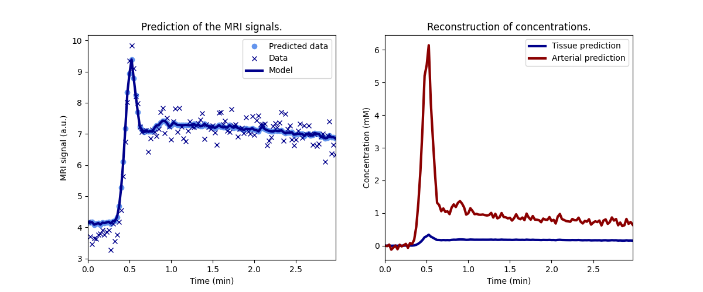

dcmri
=====

.. image:: https://github.com/dcmri/dcmri/actions/workflows/pytest-actions.yaml/badge.svg?branch=dev
  :target: https://github.com/dcmri/dcmri/actions/workflows/pytest-actions.yaml

.. image:: https://codecov.io/gh/plaresmedima/dcmri/graph/badge.svg?token=DLVVTWQ0HA 
  :target: https://codecov.io/gh/plaresmedima/dcmri

.. image:: https://img.shields.io/pypi/v/dcmri?label=pypi%20package 
  :target: https://pypi.org/project/dcmri/

.. image:: https://img.shields.io/pypi/dm/dcmri
  :target: https://pypistats.org/packages/dcmri

.. image:: https://img.shields.io/badge/License-Apache_2.0-blue.svg
  :target: https://opensource.org/licenses/Apache-2.0

dcmri is a python toolbox for dynamic contrast MRI.

**Note:** *dcmri is under construction. At this stage, the API may still change and features may be deprecated without warning.*

- **Documentation:** https://dcmri.org
- **Source:** https://github.com/dcmri

Install
-------

Install the latest version of dcmri::

    $ pip install dcmri

Basic usage
-----------

.. code-block:: python

   import dcmri as dc

   time, aif, roi, _ = dc.fake_tissue(CNR=50)   # Generate some test data
   tissue = dc.Tissue(aif=aif, t=time)          # Launch a standard tissue model
   tissue.train(time, roi)                      # Train the model on the data
   tissue.plot(time, roi)                       # Check the fit to the data

Print the fitted parameters:

.. code-block:: python

   tissue.print(round_to=3)

::

    --------------------------------
    Free parameters with their stdev
    --------------------------------

    Permeability-surface area product (PS): 0.003 (0.0) mL/sec/mL
    Plasma volume (vp): 0.036 (0.002) mL/mL
    Extravascular extracellular volume (ve): 0.185 (0.005) mL/mL

    ------------------
    Derived parameters
    ------------------

    Plasma flow (Fp): inf mL/sec/mL
    Volume transfer constant (Ktrans): 0.003 mL/sec/mL
    Blood volume (vb): 0.065 mL/mL
    Extracellular volume (v): 0.22 mL/mL
    Extracellular mean transit time (Te): 68.805 sec
    Extravascular transfer constant (kep): 0.015 1/sec
    Extraction fraction (E): 0.0
    Plasma mean transit time (Tp): 0.0 sec
    Blood mean transit time (Tb): 0.0 sec
    Mean transit time (T): 0.0 sec
    Transendothelial water PS (PSe): 10 mL/sec/mL
    Transcytolemmal water PS (PSc): 10 mL/sec/mL
    Intracellular water mean transit time (Twc): 0.075 sec
    Interstitial water mean transit time (Twi): 0.009 sec
    Intravascular water mean transit time (Twb): 0.006 sec

License
-------

Released under the `Apache 2.0 <https://opensource.org/licenses/Apache-2.0>`_  license.