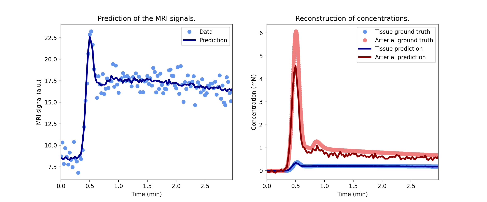

************
Fitting data
************

``dcmri`` includes a catalogue of end-to-end models that provide an easy way to fit DC-MRI data. To illustrate how these work, let's start by importing the package:

.. code-block:: python

    import dcmri as dc
    
Generate some synthetic data using one of the built-in functions `dcmri.fake_tissue`:

.. code-block:: python

    time, aif, roi, _ = dc.fake_tissue()

Here *time* is an array of time points, *aif* is a signal-time curve measured in a feeding artery at those times, and *roi* is a signal-time curve measured in a region of interest. 

Next we find a suitable model from the :ref:`model catalogue <end-to-end models>` and initialize it:

.. code-block:: python

    model = dc.Tissue(aif,
        dt = time[1],
        agent = 'gadodiamide',
        field_strength = 3.0,
        TR = 0.005,
        FA = 20,
        Hct = 0.45, 
        R10 = 1/dc.T1(3.0,'muscle'),
        R10b = 1/dc.T1(3.0,'blood'),
        n0 = 5,
    )

Train the model on the ROI data:

.. code-block:: python  

    model.train(time, roi)

And that's it. We can now display the fitted model parameters:

.. code-block:: python

    model.print(round_to=2)

.. code-block:: console

    -----------------------------------------
    Free parameters with their errors (stdev)
    -----------------------------------------
    Plasma volume (vp): 0.05 (0.0) mL/mL
    Volume transfer constant (Ktrans): 0.003 (0.0) 1/sec
    Extravascular extracellular volume (ve): 0.3 (0.0) mL/mL
    Signal scaling factor (S0): 150.007 (0.02) a.u.
    ------------------
    Derived parameters
    ------------------
    Extracellular mean transit time (Te): 99.771 sec
    Extravascular transfer constant (kep): 0.01 1/sec
    Extracellular volume (v): 0.35 mL/mL

``dcmri`` end-to-end models also come with some utilities, i.e. a plot function to visualise the goodness of fit:

.. code-block:: python

    model.plot(time, roi)

