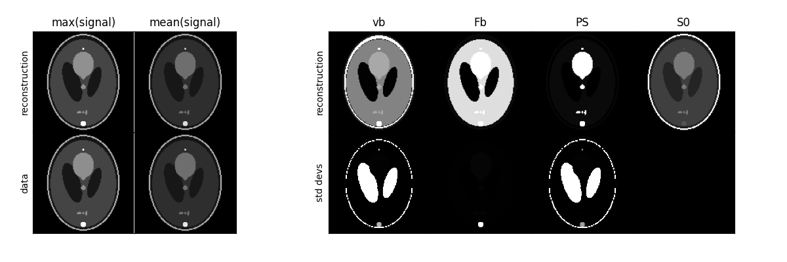

***************
Getting started
***************

Installation
------------

``dcmri`` can be installed using pip:

.. code-block:: console

   pip install dcmri

Basic usage
-----------

The most common application of DCMRI involves measurement of the endothelial 
permeability using a steady-state MRI sequence 
and a `Tofts model <https://pubmed.ncbi.nlm.nih.gov/10508281/>`_. In this 
section we illustrate the basic usage of ``dcmri`` by applying this model to 
synthetic data. 

We start by import the package and generating synthetic region-of-interest 
(ROI) data using `dcmri.fake_tissue`. 
We want these to look realistic, so we are adding noise with a 
contrast-to-noise ratio (CNR) of 50:

.. code-block:: python

    import dcmri as dc
    
    time, aif, roi, _ = dc.fake_tissue(CNR=50)

Here *time* is an array of time points, *aif* is a signal-time curve measured 
in a feeding artery at those times, and *roi* is a signal-time curve measured 
in a region of interest. 

Next we find a suitable tissue type from the 
:ref:`tissue bank <end-to-end models>` and initialize it. For most common 
applications, this will be `dcmri.Tissue`:

.. code-block:: python

    tissue = dc.Tissue(aif=aif, t=time) 

At this point this is still a generic tissue with default parameter values. 
The next step is to train the tissue using the ROI data:

.. code-block:: python  

    tissue.train(time, roi)

And that's it. We can now display the measured tissue parameters:

.. code-block:: python

    tissue.print_params(round_to=3)

.. code-block:: console

    --------------------------------
    Free parameters with their stdev
    --------------------------------

    Blood volume (vb): 0.018 (0.002) mL/cm3
    Interstitial volume (vi): 0.174 (0.004) mL/cm3
    Permeability-surface area product (PS): 0.002 (0.0) mL/sec/cm3

    ----------------------------
    Fixed and derived parameters
    ----------------------------

    Tissue Hematocrit (H): 0.45 
    Plasma volume (vp): 0.01 mL/cm3
    Interstitial mean transit time (Ti): 74.614 sec
    B1-corrected Flip Angle (FAcorr): 15 deg

The standard deviations of the free parameters are orders of magnitude 
smaller than the value itself, which offers confidence that the tissue 
properties are well determined by the data. 

We should also verify that the 
trained tissue does indeed predict the data correctly. Since visualisation 
of results is an integral part of the data analysis, ``dcmri`` includes some 
basic plotting functions:

.. code-block:: python

    tissue.plot(time, roi)

.. image:: tissue.png
  :width: 600

The signal plot on the left shows that the model correctly predicts the 
measured data, except for the noise. The plot on the right shows that 
the reconstructed concentrations in blood and tissue have the expected 
profiles and that values are in an expected range for a standard contrast 
agent injection (0-5mM in blood).

Custom analysis
---------------

Since the extended Tofts model is the most widely used approach, it is set as 
default in `dcmri.Tissue` and does not need to be specified explicitly. 
Similarly other configurations such as initial values, parameter ranges and 
which parameters to fix in the analysis - are set to reasonable defaults. 

Analysing the data with other configurations is not much more difficult. Let's 
do the analysis again, but this time allowing for restricted water-exchange 
across the tissue cell walls:

.. code-block:: python

    tissue = dc.Tissue(aif=aif, t=time, water_exchange='FR') 
    tissue.train(time, roi).print_params(round_to=3)

.. code-block:: console

    --------------------------------
    Free parameters with their stdev
    --------------------------------

    Transcytolemmal water PS (PSc): 533.268 (19598.606) mL/sec/cm3
    Blood volume (vb): 0.018 (0.002) mL/cm3
    Interstitial volume (vi): 0.174 (0.007) mL/cm3
    Permeability-surface area product (PS): 0.002 (0.0) mL/sec/cm3

    ----------------------------
    Fixed and derived parameters
    ----------------------------

    Tissue Hematocrit (H): 0.45
    Plasma volume (vp): 0.01 mL/cm3
    Interstitial mean transit time (Ti): 74.605 sec
    Intracellular water mean transit time (Twc): 0.002 sec
    B1-corrected Flip Angle (FAcorr): 15 deg

We now get an additional value for the water exchange exchange across the 
cell wall - which is very high in this case (and imprecise) because the 
synthetic data are generated for a tissue with infinite water exchange.  

Fitting data with restricted water exchange is generally considered a more 
advanced approach to DCMRI, but with `dcmri.Tissue` it is straightforward 
and intuitive. 

Any other options can be set in the same way. As an example, we run this same 
model again, but this time we provide a different initial value for the blood 
volume, and we allow the B1-correction factor to vary (by default this is 
fixed to 1):

.. code-block:: python

    tissue = dc.Tissue(aif=aif, t=time, water_exchange='FR', vb=0.5)
    tissue.set_free(B1corr=[0,2])
    tissue.train(time, roi).print_params(round_to=3)

.. code-block:: console

    --------------------------------
    Free parameters with their stdev
    --------------------------------

    Transcytolemmal water PS (PSc): 264.663 (16140.959) mL/sec/cm3
    Blood volume (vb): 0.017 (0.003) mL/cm3
    Interstitial volume (vi): 0.169 (0.022) mL/cm3
    Permeability-surface area product (PS): 0.002 (0.0) mL/sec/cm3
    Tissue B1-correction factor (B1corr): 0.98 (0.027)

    ----------------------------
    Fixed and derived parameters
    ----------------------------

    Tissue Hematocrit (H): 0.45
    Plasma volume (vp): 0.009 mL/cm3
    Interstitial mean transit time (Ti): 74.373 sec
    Intracellular water mean transit time (Twc): 0.003 sec
    B1-corrected Flip Angle (FAcorr): 14.701 deg

Since the synthetic data are generated with an exact flip angle, the B1 
correction is close to 1 as expected. 

Pixel-based analysis
--------------------

``dcmri`` includes dedicated tools for pixel-based analysis. To illustrate these, 
we analyse synthetic brain images with an extended Tofts model. 

First let's generate some synthetic brain images. For the purpose of this 
illustration we use coarse 128 x 128 images:

.. code-block:: python

    n = 128
    time, signal, aif, _ = dc.fake_brain(n)

In this case, *time* and *aif* are still 1D arrays of time points, but 
*signal* is 3D array (2D + time) with pixel-based synthetic data. 

Since the data are now images, we analyse them using `dcmri.TissueArray` 
instead of `dcmri.Tissue`:

.. code-block:: python

    shape = (n, n)
    image = dc.TissueArray(shape, aif=aif, t=time, verbose=1)

Since pixel-based computations take more time, we display a progress bar 
during computations by setting the verbosity to 1. Now we train 
the image on the data and plot the results:

.. code-block:: python

    image.train(time, signal)
    image.plot(time, signal)

.. image:: pixel.png
  :width: 600

As before - by default this runs the extended Tofts model for every pixel. 
The model predicts the data well (left) but parameter maps (right) show 
unrealistic PS values in the normal brain tissue. Let's analyse these data 
again with a model that is more suitable for whole-brain analysis:

.. code-block:: python

    image = dc.TissueArray(shape, aif=aif, t=time, verbose=1, kinetics='2CU')
    image.train(time, signal).plot(time, signal)

The PS values are now zero everywhere, except in the lesions with broken 
blood-brain barrier. The maps in the lower row also show that parameter 
estimates are unreliable in the ventricles, which are not accessible to the 
contrast agent. 

Further customization of pixel-based models, such as 
setting initial values or modifying parameter ranges, also works in the same 
way as for the ROI-based model `dcmri.Tissue`.