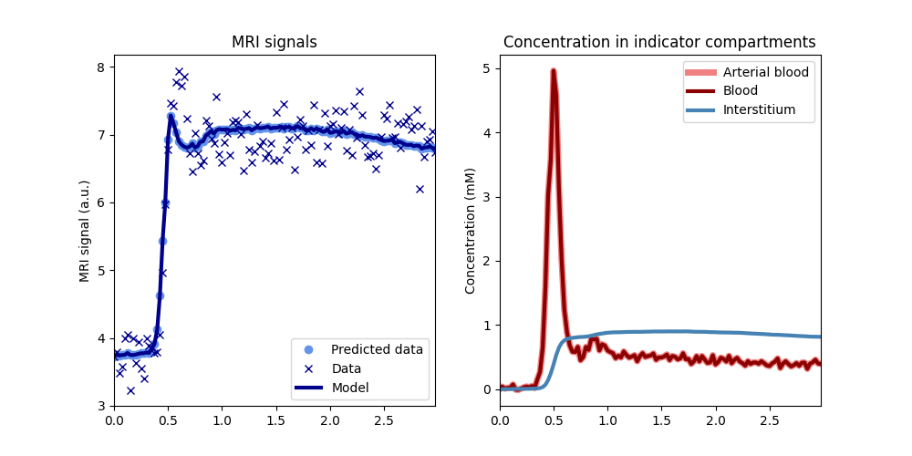

************
Fitting data
************

``dcmri`` includes a catalogue of end-to-end models that provide an easy way to fit DC-MRI data. In this section we use synthetic data to illustrate how these work. 

Let's start by importing the package:

.. code-block:: python

    import dcmri as dc
    
For the purpose of this demonstration, we generate some synthetic data using the built-in function `dcmri.fake_tissue`. We want these to look realistic, so we are adding noise with a contrast-to-noise (CNR) level of 50. We'll leave all other parameters to their default values:

.. code-block:: python

    time, aif, roi, _ = dc.fake_tissue(CNR=50)

Here *time* is an array of time points, *aif* is a signal-time curve measured in a feeding artery at those times, and *roi* is a signal-time curve measured in a region of interest. 

Next we find a suitable model from the :ref:`model catalogue <end-to-end models>` and initialize it. For the majority of applications, this will be the `dcmri.Tissue` model:

.. code-block:: python

    tissue = dc.Tissue(aif=aif, t=time)

At this point we have not used the ROI data at all, so all tissue parameters are still at their default values. The next step is to adapt those by training the model on the ROI data:

.. code-block:: python  

    model.train(time, roi)

We can check that the model fits the data using the model's plot function:

.. code-block:: python

    model.plot(time, roi)

And we can print the model parameters after training, which is the main objective of the measurement:

.. code-block:: python

    model.print(round_to=2)

.. code-block:: console

    --------------------------------
    Free parameters with their stdev
    --------------------------------

    Permeability-surface area product (PS): 0.003 (0.0) mL/sec/mL
    Plasma volume (vp): 0.036 (0.002) mL/mL
    Extravascular extracellular volume (ve): 0.185 (0.005) mL/mL

    ------------------
    Derived parameters
    ------------------

    Plasma flow (Fp): inf mL/sec/mL
    Volume transfer constant (Ktrans): 0.003 mL/sec/mL
    Blood volume (vb): 0.065 mL/mL
    Extracellular volume (v): 0.22 mL/mL
    Extracellular mean transit time (Te): 68.805 sec
    Extravascular transfer constant (kep): 0.015 1/sec
    Extraction fraction (E): 0.0
    Plasma mean transit time (Tp): 0.0 sec
    Blood mean transit time (Tb): 0.0 sec
    Mean transit time (T): 0.0 sec
    Transendothelial water PS (PSe): 10 mL/sec/mL
    Transcytolemmal water PS (PSc): 10 mL/sec/mL
    Intracellular water mean transit time (Twc): 0.075 sec
    Interstitial water mean transit time (Twi): 0.009 sec
    Intravascular water mean transit time (Twb): 0.006 sec

